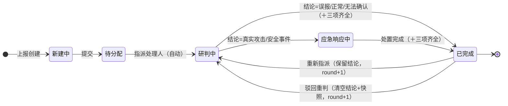

# 研判处理闭环设计说明

> 告警从上报到归档的标准处理流,以及"已完成 → 重新研判"的闭环反馈机制。
> 本文档描述状态机、属性联动规则、完成门控与实现位置,是研判分析工作台的运营流程基准。

---

## 1. 状态机

**正向处理流**:新建中 → 待分配 → 研判中 →（按结论分流）→ 已完成。

**结论分流**（在"研判中"出结论时）:
- 结论为 **真实攻击 / 安全事件** → 自动转入 **应急响应中**（遏制·根除·恢复）。
- 结论为 **误报 / 正常业务 / 无法确认** → 留在研判中,补齐信息后直接完成。
- 每个结论都必须有对应处置(误报→优化规则、正常业务→加白、无法确认→持续观察),**没有"无需处置"路径**。

**闭环反馈**（"已完成"可被重新打开,均 `round + 1`,历史流转记录始终保留）:
- **重新指派**（换人续办）:对已完成告警指派新处理人 → **清空**原结论与三项快照,带入新处理人进入**研判中**。
- **驳回重判**（清空重启）:审核不通过打回 → **清空**结论、当前处理人、三项快照,回退至**待分配**,重走一遍流程。
- **手动状态下拉不能重开**:已完成告警在详情页锁定,后端拒绝 `closed → 活动态` 的直接改状态;重开只能走上述两个按钮入口。

---

## 2. 属性联动矩阵

每个触发事件对运营属性的联动规则(写入 / 等待输入 / 保留 / 清空):

| 触发事件 | 告警状态 | 告警结论 | 当前处理人 （=处置人） | 处置信息 （研判依据·举证信息·处置建议） | 轮次 |
|---|---|---|---|---|---|
| ① 上报创建 | 新建中 | 空·待定 | 空 | 空 | = 1 |
| ② 提交 | → 待分配 | 保留(空) | 待指派 | 空 | 不变 |
| ③ 手动指派 | → 研判中（自动接手） | 等待研判输入 | **写入·被指派人** | 等待录入 | 不变 |
| ④ 出结论·常规处置 | → 已完成（三项齐全方可） | **写入**（误报/正常/无法确认） | 保留 | **三项必填** | 不变 |
| ⑤ 出结论·事件处置 | → 应急响应中 | **写入**（真实攻击/安全事件） | 保留 | 处置建议待执行 | 不变 |
| ⑥ 处置完成 | → 已完成（三项非空方可） | 保留 | 保留 | **三项必填** | 不变 |
| ⑦ 重新指派 | → 研判中 | **清空·需重判** | **变更·新指派** | **清空** | **+ 1** |
| ⑧ 驳回重判 | → 待分配 | **清空·需重判** | **清空** | **清空** | **+ 1** |

---

## 3. 完成门控

进入「已完成」的前置条件（行④/⑥统一适用）:

1. 有结论；
2. **研判依据（key_evidence）、举证信息（evidence_info）、处置建议（handling_suggestion）三项均非空**。

任一缺失则拒绝完成,后端返回 `完成前请补全：<缺失项>`。三项在**完成时**校验、出结论/转应急响应时**不强制**——处置执行完再补齐即可,贴合真实处置节奏。

三项快照采取"关键信息只保留最新"策略:研判信息区的三个文本框保存最新值到字段,并把每次变更追加到研判记录(按轮次归档);打开告警时从字段回填。

---

## 4. 研判轮次（round）

- 告警与每条记录都带 `round`;每次"从已完成回流"(重新指派 / 驳回)`round + 1`。
- 研判记录 / 流转记录按轮次分隔展示,历史不覆盖,形成"研判 → 完成 → 驳回 → 再研判 → 再完成"的可追溯闭环。

---

## 5. 关键规则 / 不变量

- **状态是驱动轴**:属性变化几乎都由状态转移事件触发,而非各自独立编辑。
- **结论**只在出结论时写入、驳回时清空、重新指派时保留。
- **处理人**只在指派 / 重新指派时写入或变更,其余保留;**处置人即当前处理人**,不设独立字段。
- **处置信息**（三项）在研判/应急阶段录入,驳回清空、重新指派保留。
- **轮次**只在从已完成回流时 +1,是闭环的计数锚。
- **reopen 分场景**:仅两个入口可重开已完成告警,均 `round+1` 并保留流转记录。**重新指派**=清空结论+三项快照、带入新处理人→研判中;**驳回重判**=清空结论+处理人+三项快照→待分配。手动状态下拉禁止 `closed → 活动态`(后端拦截 + 前端锁定)。
- **"等待输入" = UI 待办**:空的必填项在界面高亮"完成前必填",推动处理人向下走。
- 任何 reopen 都不会停留在"已完成"。

---

## 6. 实现位置

**后端** `backend/services/incident_service.py`
- `STATUS_VALUES`:含 `responding = 应急响应中`。
- `INCIDENT_CONCLUSIONS = {true_positive, incident}`。
- `set_conclusion(...)`:事件类结论自动 `set_status(responding)`。
- `set_status(..., 'closed')`:完成门控,校验三项非空。
- `set_handlers(...)`:已完成告警重新指派 → 回研判中并 `round+1`(保留结论/快照)。
- `reject_alert(alert_id, reason, actor)`:驳回,清空结论+三项快照,`round+1`,历史入记录。
- `add_note(...)`:按告警当前 `round` 给记录打标。

**后端 API** `backend/api/incident.py`
- `POST /alerts/<id>/conclusion`、`POST /alerts/<id>/status`、`PUT /alerts/<id>/handlers`、`POST /alerts/<id>/reject`。

**前端** `frontend/src/views/Incident.vue`
- `statusOptions` 含"应急响应中";`statusTag('responding') = danger`。
- `changeConclusion`（轻量出结论 + 路由）、`changeStatus`（门控失败回退下拉）、`submitResearchNote`（三项持久化+历史+回填）、`submitReject`、`groupByRound`（分轮展示）。

**数据字段**（alerts 表）:`status` / `conclusion` / `handlers` / `key_evidence` / `evidence_info` / `handling_suggestion` / `round`;notes 表含 `round`。

---

## 7. 结论与状态取值

**结论**（CONCLUSION_VALUES）:`false_positive` 告警误报 · `business` 正常业务 · `true_positive` 真实攻击 · `incident` 安全事件 · `unknown` 无法确认。

**状态**（主流转）:`new` 新建中 · `pending` 待分配 · `investigating` 研判中 · `responding` 应急响应中 · `closed` 已完成。

---

*本文档随研判流程实现同步维护;状态机与矩阵图由会话内可视化生成。*
